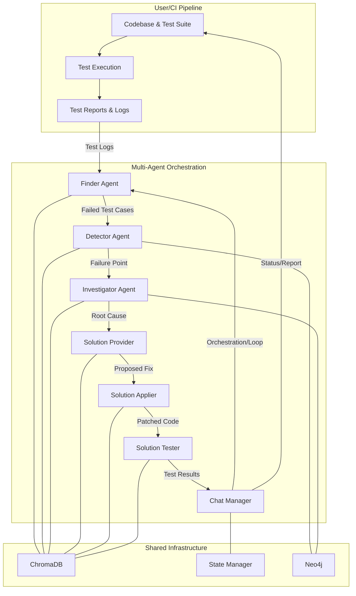

# Architecture: Multi-Agent AI Self-Healing System

## Agent Legend
- **Finder Agent**: LLM, parses logs, finds failed tests
- **Detector Agent**: LLM + Neo4j, locates failure points
- **Investigator Agent**: LLM + diff/DOM, analyzes root cause
- **Solution Provider**: LLM + RAG, proposes fixes
- **Solution Applier**: LLM + GitHub API, applies fixes
- **Solution Tester**: Pytest/Selenium, validates fixes
- **Chat Manager**: LLM + state, orchestrates agents
- **ChromaDB**: Global memory
- **State Manager**: Workflow state
- **Neo4j**: Knowledge graph

## System Overview
- **User/CI Pipeline**: Runs the test suite and provides logs/reports to the system.
- **Finder Agent**: Uses LLM to parse logs and identify failed tests.
- **Detector Agent**: Uses LLM and Neo4j knowledge graph to locate failure points and dependencies.
- **Investigator Agent**: Uses LLM and code/DOM diff tools to analyze the root cause.
- **Solution Provider Agent**: Uses LLM with Retrieval-Augmented Generation (RAG) to propose fixes.
- **Solution Applier Agent**: Uses LLM and GitHub API to apply code changes.
- **Solution Tester Agent**: Runs tests (e.g., Pytest, Selenium) to validate fixes.
- **Chat Manager**: Uses LLM to coordinate agents, manage state, and handle backpropagation if failures persist.
- **ChromaDB**: Shared memory for agent communication and context.
- **State Manager**: Tracks workflow state and agent progress.
- **Neo4j**: Knowledge graph for codebase dependencies and relationships.

## Data & Control Flow
1. **Test logs** are generated by the CI pipeline and fed to the Finder Agent.
2. **Finder Agent** identifies failed tests and passes them to the Detector Agent.
3. **Detector Agent** queries the knowledge graph (Neo4j) to locate where and why the failure occurred.
4. **Investigator Agent** analyzes the failure context, code diffs, and UI/API changes.
5. **Solution Provider Agent** uses LLM + RAG to generate a fix based on all available context.
6. **Solution Applier Agent** applies the fix to the codebase (optionally via GitHub API).
7. **Solution Tester Agent** re-runs the tests to validate the fix.
8. **Chat Manager** coordinates the agents, manages state, and loops back if failures persist.
9. **ChromaDB** and **State Manager** provide shared memory and workflow state for all agents.
10. **Neo4j** is used by Detector and Investigator for dependency and impact analysis.

## Technologies Used
- **LLM (transformers, GPT, etc.)**: For agent reasoning, prompt-based analysis, and code generation.
- **Neo4j**: For knowledge graph and dependency tracking.
- **ChromaDB**: For global memory and context sharing.
- **Pytest/Selenium/Playwright**: For test execution and validation.
- **GitHub API**: For automated code changes and PRs.
- **FastAPI/Flask**: (Optional) For exposing the system as a service.

# Outcome
A fully automated, self-healing test pipeline with minimal human intervention, leveraging multi-agent AI, knowledge graphs, and LLMs for robust, scalable automation.