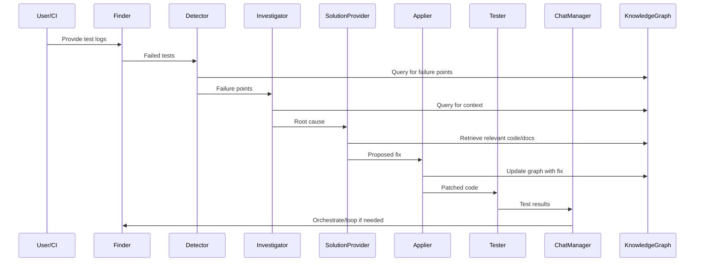

# Solution Approach: Multi-Agent AI Self-Healing System

## 1. Repository-to-Knowledge-Graph Conversion and GraphRAG

### 1.1 Repository/File to Knowledge Graph
When a repository or file (Business Requirements Document) is provided, it is parsed and analyzed to extract its structural and semantic components. The process involves:

- **Parsing and Static Analysis** (should try different types and then decide the best suitable one): Use language-specific parsers (e.g., Python's `ast`, JavaScript's `acorn`, Java's `javaparser`) to build Abstract Syntax Trees (ASTs) and extract entities such as functions, classes, modules, and their relationships (calls, imports, inheritance, etc.).
- **Documentation and Test Extraction** (it may be removed, as it will increase the computation): Use tools like `docutils` or custom regex/markdown parsers to extract logical sections, test coverage, and links to code entities from documentation and test files.
- **Chunking**: The codebase is divided into meaningful chunks:
  - **AST-based Chunking**: Code is chunked at the function, class, or module level, preserving logical boundaries and context. This is implemented by traversing the AST and extracting code blocks as separate units.
  - **Sliding Window with Overlap**: For very large files, a sliding window (e.g., 100-200 lines with 20-40 line overlap) is used to maintain context across chunk boundaries. This is implemented by iterating over the file with a window and overlap stride.
  - **Hybrid Chunking**: For mixed content (code + docs), combine AST-based chunking for code and section-based chunking for documentation (e.g., using markdown headers as boundaries).
- **Graph Construction** (Can be Improved): Each chunk becomes a node in the knowledge graph (using a property graph database like Neo4j). Edges are created to represent relationships such as function calls, imports, test coverage, documentation links, and dependencies. The graph is continuously updated as the codebase evolves.

#### How to Improve Chunking (Improvement can be done)
- Use **semantic similarity** (e.g., using embeddings) to merge or split chunks that are too small or too large.
- Dynamically adjust chunk size based on code complexity (e.g., cyclomatic complexity).
- For multi-language repos, use language-agnostic chunking frameworks (e.g., tree-sitter).

### 1.2 Establishing GraphRAG (Graph Retrieval-Augmented Generation) (Important Part)
- **Indexing and Embedding** : Each chunk/node is embedded using language models (e.g., OpenAI, HuggingFace, or open-source models like `Instructor-XL`) to enable semantic search and retrieval. Embeddings are stored in a vector database (e.g., ChromaDB, Pinecone, or FAISS).
- **Graph-Driven Retrieval**: When the LLM is prompted (for root cause analysis, fix generation, etc.), it queries the knowledge graph to retrieve the most relevant chunks and their direct/indirect relationships (dependencies, callers, callees, related tests). Retrieval can use a combination of:
  - **Vector similarity search**: Retrieve top-k semantically similar chunks.
  - **Graph traversal**: Expand the context by traversing edges (e.g., up to N hops for dependencies).
  - **Hybrid scoring**: Combine semantic similarity and graph proximity (e.g., `score = alpha * sim + beta * (1/distance)`).
- **Context Assembly**: The retrieved subgraph (relevant nodes and their context) is assembled and provided as input context to the LLM, ensuring that the model has both the semantic and structural information needed for deep reasoning.

#### Example Prompt for LLM
```
You are an expert software agent. Given the following code context and test failure, identify the root cause and propose a fix.

Code Context:
<insert retrieved code chunks here>

Test Failure:
<insert test log/error message here>

Knowledge Graph Relationships:
<insert relevant graph edges/metadata here>
```

#### How to Improve GraphRAG (hybrid approach will also be better)
- Use **dynamic prompt construction**: Only include the most relevant nodes/edges to avoid context overflow.
- Use **attention mechanisms** or **graph neural networks** to better aggregate information from the graph.
- Use **feedback loops**: If the LLM's output is not satisfactory, expand the graph context and retry.

### 1.3 Benefits of This Approach
- **Scalability**: Chunking and graph-based retrieval allow the system to handle very large codebases efficiently, retrieving only the most relevant context for each query.
- **Explainability**: The knowledge graph provides a transparent, navigable structure that explains why certain code or documentation was retrieved and used by the LLM.
- **Precision**: By leveraging both semantic similarity and explicit code relationships, the system delivers highly targeted and context-rich information to the LLM, improving the quality of analysis and generated fixes.
- **Continuous Adaptation**: As the codebase changes, the knowledge graph and embeddings are updated, ensuring that retrieval and reasoning always reflect the latest state.

---

## 2. Multi-Agent Workflow and Implementation

### 2.1 Agent Roles and Methods

| Agent                  | Method/Frameworks Used         | How It Works / Details                                                                 |
|------------------------|-------------------------------|----------------------------------------------------------------------------------------|
| Finder Agent           | LLM (OpenAI, Transformers)    | Parses logs using prompt-based extraction to identify failed tests and error messages.  |
| Detector Agent         | Neo4j, Cypher, LLM            | Maps failed tests to code entities using graph queries and LLM for ambiguous cases.     |
| Investigator Agent     | LLM, diff tools, Neo4j        | Analyzes root cause using code/DOM diffs, graph context, and historical failures.       |
| Solution Provider      | LLM + GraphRAG, ChromaDB      | Uses GraphRAG to retrieve context and propose fixes; prompt includes code, graph, logs. |
| Solution Applier       | GitHub API, Neo4j             | Applies fixes, updates codebase and knowledge graph, links fix to failure event.        |
| Solution Tester        | Pytest/Selenium/Playwright    | Runs tests to validate fixes, reports results, updates graph.                          |
| Chat Manager           | State machine, ChromaDB       | Orchestrates workflow, manages state, handles retries and backpropagation.              |

#### Example: Detector Agent Cypher Query
```
MATCH (t:TestCase {name: $testName})-[:TESTS]->(c:CodeEntity)
RETURN c
```

#### Example: Solution Provider Agent Prompt
```
You are an expert code fixer. Given the following code context and failure, propose a minimal, safe fix.

Code Context:
<retrieved code chunks>

Failure:
<test log>

Graph Relationships:
<edges/metadata>
```

### 2.2 Data & Control Flow



---

## 3. Frameworks and Tools

- **Parsing/Chunking**: Python `ast`, JavaScript `acorn`, Java `javaparser`, `tree-sitter` (multi-language)
- **Knowledge Graph**: Neo4j (Cypher queries, property graph model)
- **Vector Database**: ChromaDB, Pinecone, FAISS
- **LLMs**: OpenAI GPT, HuggingFace Transformers, Instructor-XL
- **Test Execution**: Pytest, Selenium, Playwright
- **Orchestration/State**: ChromaDB, custom state machine
- **APIs/Automation**: GitHub API, REST/GraphQL

---

## 4. How Each Method Helps

- **AST-based Chunking**: Ensures each node is a logical, self-contained unit, improving retrieval and LLM context.
- **Sliding Window**: Preserves context for LLMs in large or procedural files.
- **Graph Construction**: Enables fast, explainable traversal for dependency and impact analysis.
- **GraphRAG**: Combines semantic and structural retrieval for high-quality LLM input.
- **Prompt Engineering**: Carefully designed prompts ensure the LLM receives all necessary context and instructions for each task.
- **Hybrid Retrieval**: Merges semantic similarity and graph proximity for optimal context selection.
- **Continuous Graph/Embedding Update**: Keeps the system in sync with the latest codebase state.

